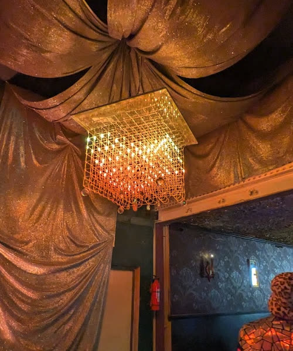
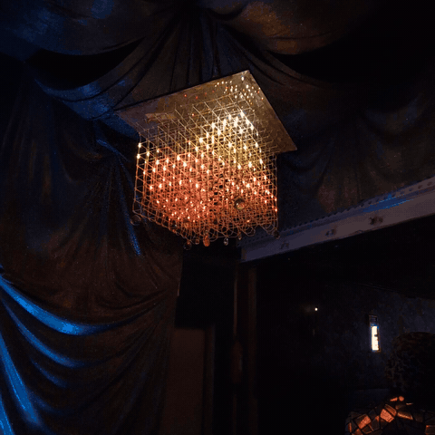
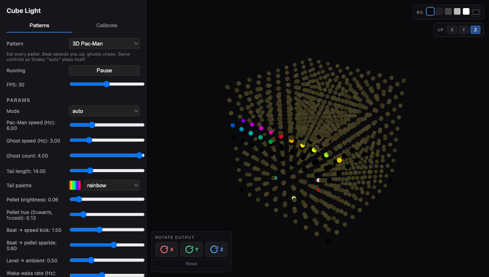
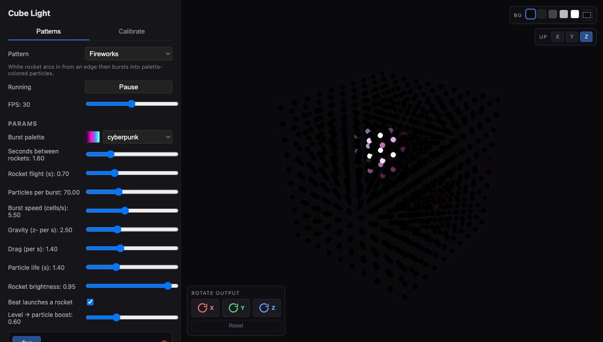
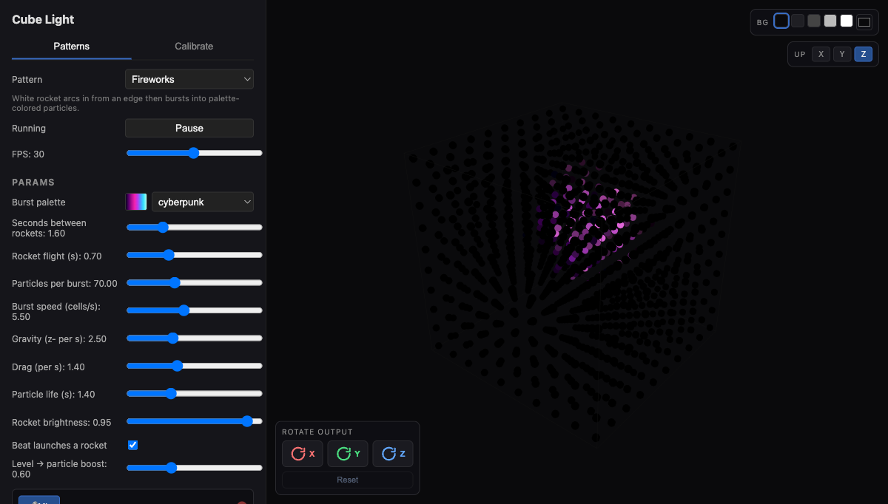
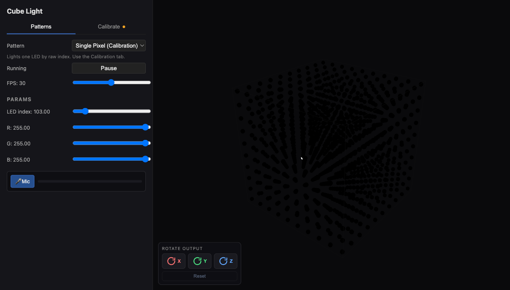
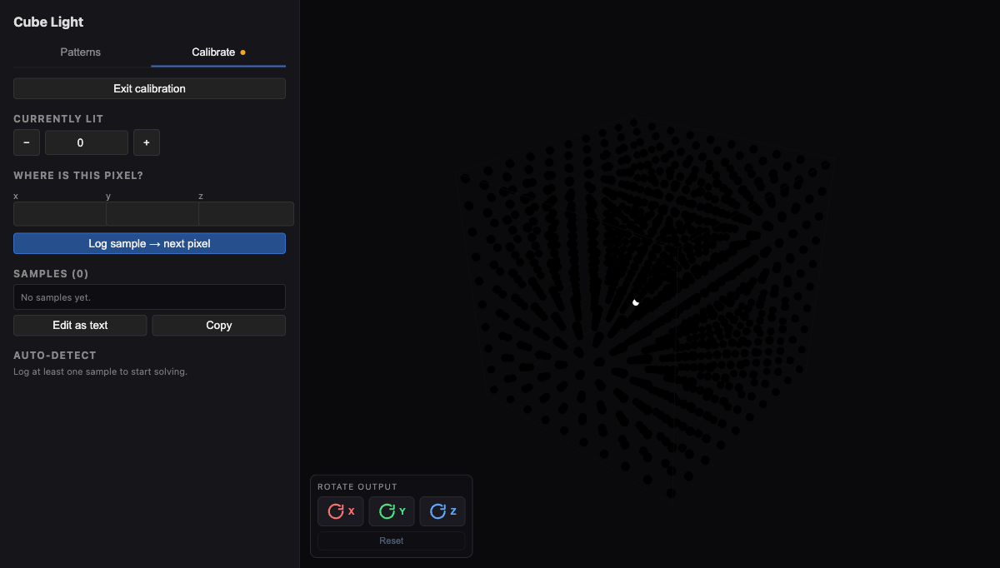
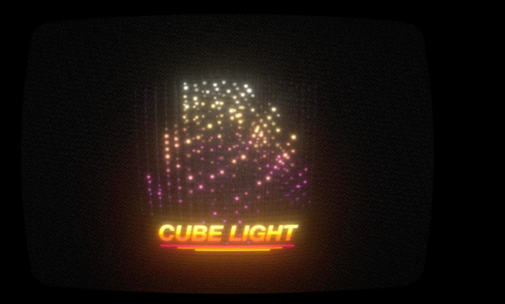
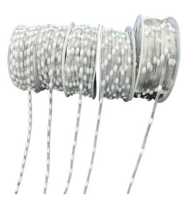
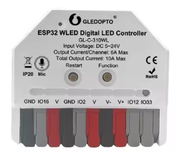

# cube-light

**A 10×10×10 music reactive LED cube.** One thousand addressable pixels, an
ESP32 microcontroller that lives inside the cube, a phone-friendly console. And 3D snake!

| | |
|---|---|
|  |  |

It went to the playa in 2026 and ran for a week off in our camp's [speakeasy](https://www.instagram.com/p/DdFiTw2u4o9/).
[Here's a minute of it](docs/media/cube-light-playa.mp4) lit up at home and mid-build.
This repo is everything needed to build one: the firmware, the console, the
calibration tools, and (soon) the physical build notes. The firmware is all custom, which allows much more interesting music-reactivity and varied patterning.



## What it does

- **28 patterns** written against `(x, y, z)` voxels rather than a strip: wavy
  sheet, rotating planes, rain, comets, storm cloud, spirals, orbiting atoms,
  a tumbling wireframe cube, a first-person neon rail ride, a synesthetic
  tunnel, a double helix, TV static, fireworks, a 3D text marquee, album art
  on all four faces, and more.
- **Music-reactive.** An onboard mic feeds an FFT, eight log-spaced bands, a
  loudness envelope and a beat detector into every pattern. Patterns choose
  what to do with it: throb, spin faster, spawn ripples, kick the rail.
- **Games.** 3D Snake and 3D Pac-Man with a phone game pad (or they play
  themselves with a BFS solver when nobody is holding the controls).
- **Presets and playlists.** Save any pattern + params + palette as a preset,
  weight it, and let the cube cycle. Curated playlists, shuffle, a demo dwell
  for filming, and a physical button that steps to the next preset.
- **Guest mode.** Anyone who joins the cube's hotspot gets patterns, knobs,
  brightness and the game pad. Settings, Wi-Fi and calibration stay behind an
  owner password. Flip one switch and the hotspot password is the only gate.
- **Home Assistant.** MQTT discovery publishes a light, pattern and preset
  selects, playlist transport, and a text entity. Song titles and album art
  from your media player show up on the cube. See
  [docs/home-assistant.md](docs/home-assistant.md).
- **Per-parameter modulation.** Any numeric knob can ride an LFO or a random
  walk, so a static preset keeps evolving.
- **Calibration that solves your wiring.** Light one LED, say where it is,
  repeat a few times; the cube works out axis order, flips and serpentine
  runs from 192 candidate layouts. Snipped-LED compensation keeps geometry
  correct after you cut a dead pixel out of a chain.
- **Runs on ~$20 of controller.** A Gledopto WLED controller straight out of
  the box, or any classic ESP32 plus an I2S microphone.

| | |
|---|---|
|  |  |
|  |  |

*Screenshots are from the retired browser preview. For the real thing without
a cube, the [browser simulator](simulator/) runs the firmware's own pattern
code (compiled to WebAssembly) and draws it like a 1984 CRT logo card.*



## Building one

Three parts: a cube of LEDs, a controller, and this firmware.

### 1. The cube

- **1000 × 12 V WS2811 "seed" pixels**, wired as two chains of 500. Seed
  pixels (the tiny ones on thin wire, not 12 mm bullets) matter: the cube
  reads as points of light in air rather than a wall of bulbs. These are
  [the RGB ones I used](https://www.aliexpress.us/item/3256807315916397.html);
  BTF-Lighting, Ray Wu and the usual AliExpress storefronts all sell similar
  1000-pixel strings under *WS2811 12V seed pixel string*.

  

    - Almost certainly, SK6812-style lights with their own white (RGBW) would look better, for a bit more money - here's a listing of ones I've used elsewhere [https://www.aliexpress.us/item/3256805834823384.html]. I haven't tried it with my cube light build, though.
    - If you wanted to do 5V instead of 12V, you'd probably get power dropoff with two runs of 500 leds. Easy enough - just have power injection more frequently. The code would need (tiny) modification if you wanted more than two data lines, though.
- A frame that holds 10 vertical strings of 100 pixels each in a 10×10 grid. Any wiring order works because calibration solves it afterwards. I ran it as a long snake that would go top down on one column, then bottom up on the next, etc. This required a bit of code calibration, because the first pixel of the run was at 0,0,0, but the second pixel is 0,0,1, while 0,1,0 was the 10th pixel and 1,0,0 was the 200th. 
    - What didn't work well: version one had two acrylic sheets - top and bottom plane, with holes drilled out and the lights strung through. I'd hoped the weight of the bottom sheet would pull everything down. However, getting the wires taut in between was tricky, and everything looked sloppy.
    - What *did* work: 3D-printed clips, keeping all the planes connected. STLs, OpenSCAD source and print notes are in [`hardware/clips/`](hardware/clips/). I used translucent PETG and the scaffolding clips both kept the shape and didn't obscure the lights, complemented the design with a matrix look.
- A 12 V supply. The firmware's power limiter caps total draw (default 10 A); full white on 1000 pixels would be ~15 A, so the software limiter matters (or just get a big boy supply!).

Build notes, photos and the parts list are in
[docs/build.md](docs/build.md).

### 2. The controller



| Board | Mic | Flashing | Notes |
| --- | --- | --- | --- |
| **Gledopto GL-C-618WL** | onboard PDM | USB-C | The board the project was developed on. This is just a nice enclosure for an ESP-32 with mic and all the things you probably would neglect otherwise (fuse, power relay, step-up). This specific model was probably overkill - don't need the ethernet. Slightly smaller ones that would work from the same company are: GL-C-017WL-D (015 or 016 too) or the GL-C-615WL. I wouldn't expect an ESP8266 to work, I pushed this one pretty far. |
| Gledopto GL-C-310WL | onboard I2S | OTA only (no USB) | Mini version. These are just great to have around for various projects. Don't do the 309, which is mic-less - and the cube is not as exciting without one. I brought a backup to playa on a 309 without realizing it was the wrong one, glad I didn't have to use it! |
| Any ESP32 + INMP441 | I2S | USB | Wire your own; pins are build flags. |

Every board is one `[env:...]` block in
[firmware/platformio.ini](firmware/platformio.ini): LED pins, button, relay,
mic type and pins, mDNS name. Copy one and edit for new hardware.

### 3. The firmware

```bash
cd firmware
pio run -e gledopto618 -t upload      # first flash over USB
pio device monitor -e gledopto618     # 115200 baud
```

The cube comes up as a Wi-Fi hotspot named `cube-light` (password
`cubelight`, change it). Join it, open <http://cube.local/> or
<http://192.168.4.1/>, and pick a pattern. The `/wifi` page joins it to your
home network; after that, wireless updates are available from `/admin`.

No-USB boards (309/310) get their first image through stock WLED's update
page. [docs/flashing-offline.md](docs/flashing-offline.md) is the full
runbook, including recovery and the OTA size ceiling.

## The console

Everything is served from the cube itself, sized for a phone.

- `/` picks patterns (grouped into light patterns, games, and tools), exposes
  each pattern's parameters with hover help, palettes, brightness, the mic
  toggle, the preset sidebar and the playlist transport. Advanced mode reveals
  modulation and the audio-drive caps.
- `/snake` is the game pad. Direction keys are calibrated to the player's
  viewpoint so "up" means up from where you stand.
- `/admin` handles power, wireless update arming, presets import/export and
  the demo dwell. `/leds` sets outputs, color order, snipped-LED compensation
  and the mic channel/squelch. `/calibrate` runs the wiring wizard. `/wifi`
  holds network, passwords, guest mode and the Home Assistant broker.
- `/api/status`, `/api/audio` and friends are plain JSON if you want to
  script it. DNRGB packets on udp/21324 (WLED's realtime protocol) override
  the local pattern, so anything that can drive WLED can drive the cube.

## Running the engine on your computer

The pattern engine is dependency-free C++ shared between the ESP32 build and
a native harness:

```bash
firmware/native/build.sh
firmware/native/build/cube-native rez-tunnel --fake-audio --host 192.168.0.180
```

It streams DNRGB frames to a cube, to stock WLED, or to any receiver that
speaks the protocol. See [firmware/README.md](firmware/README.md) for the
engine layout and how to add a pattern.

## Simulator

[`simulator/`](simulator/) is the cube in a browser tab: the firmware engine
compiled to WebAssembly, rendered in three.js with phosphor persistence, bloom
and a full CRT pass (scanlines, grille, curvature, aberration, bleed, grain).
Your laptop mic drives the music-reactive patterns through the same band
analysis and beat detector the cube uses, or a synthetic 120 BPM groove does.
It records 5 or 10 second WebM clips, because LED cubes photograph terribly.

```bash
python3 simulator/serve.py   # then open http://127.0.0.1:5277/
```

## Roadmap

- **Build documentation** with more photos and a finished bill of materials.
- ESP-NOW hardware controller for Snake ([docs/controller-plan.md](docs/controller-plan.md)).

Open issues live in the repo's `.beads/` tracker.

## Repo layout

- `firmware/lib/core/` — the pattern engine (pure C++): geometry, palettes,
  params, audio analysis, one file per pattern.
- `firmware/src/` — ESP32 glue: networking, web console, mic capture, presets,
  Home Assistant.
- `firmware/native/` — host harness.
- `hardware/clips/` — the 3D-printed frame clips (STL + OpenSCAD).
- `simulator/` — browser simulator: the engine as WASM + three.js CRT renderer.
- `docs/` — flashing runbook, HA integration, build notes, stock-WLED config
  backups for the boards, screenshots.

The original React + Node prototype that streamed frames to stock WLED is
preserved at git tag `wled-prototype` - once I moved away from that prototyping code, I never looked back, so treat it with a grain of salt.

## License

MIT. See [LICENSE](LICENSE).
